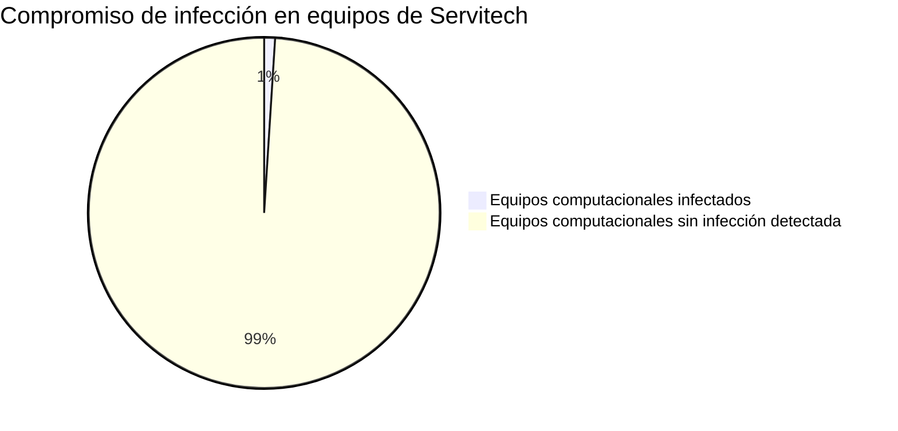

Curso "Experto en ciberseguridad", FUCAP.
Profesor: Christopher Espinoza.


## INFORME


# **ANÁLISIS DE CASO: MALWARE DETECTADO EN EQUIPO DE SUCURSAL SERVITECH**

**Alexandra Costa P.**  
09/08/2024  


## Resumen ejecutivo:


*Troyano detectado en un computador de la empresa Servitech.*
*El equipo atacado es un computador Acer, con sistema operativo Windows 10.*

•	*El día 1 de Agosto, se detectó la presencia de un troyano en este equipo. Sin embargo, los primeros indicios de actividad anómala que este equipo presentó ocurrieron durante la última semana de Julio.*

• *El principal usuario de este equipo computacional era un técnico de Servitech, quien se encontraba descargando los adjuntos de un correo electrónico enviado por un supuesto cliente. Este email indicaba contener fotos y videos de un celular averiado, incitando al técnico a pinchar un link que finalmente redireccionaba a un sitio de descarga que contenía el archivo comprimido y dentro de este se encontraba el troyano.*

*Se considera establecer un plan de acción para mitigar esta infección y prevenir posibles infecciones futuras.*

---


### Introducción

*Este documento refiere al  resumen ejecutivo en que identificamos la presencia de un malware en un equipo computacional de la empresa Servitech.*

---

#### Análisis


*Para llevar a cabo este análisis se procedió a instalar un entorno de trabajo en el cuál ejecutar ciertas herramientas de análisis forense sin generar más logs que pudiesen entorpecerlo.*

---


## Sumario del incidente

*El jueves 1 de agosto de 2024 a las 9:36 horas fue detectada la presencia de un malware de tipo troyano en un equipo computacional Acer con sistema operativo Windows 10, en la sucursal de Servitech ubicada en Av. Colón #1233, Valparaíso.*

*La empresa Servitech S.A. se encontraba realizando su rutina mensual de análisis con software antivirus (Kaspersky) en los cinco equipos computacionales con que cuentan en la sucursal. Al ejecutar este análisis, se detectó la presencia de un malware de tipo Troyano en uno de estos PC. A raíz de este hallazgo, se consultó al técnico que trabajaba con dicho equipo si había accedido a través de este mismo a sitios inseguros, si había descargado algún archivo recientemente o si se percató de algún comportamiento anómalo. El técnico señaló no tener noción de haber ingresado a sitios inseguros ni haber descargado archivos, sin embargo, recordó haber visto abrirse una consola CMD un par de ocasiones y que, ante el desconocimiento de por qué ocurría esto, decidió tomar una captura de pantalla pensando en posteriormente informarlo.*


*Durante la tarde del día Jueves se realizó una inspección detallada de este equipo infectado, siendo retirado de la sucursal por el equipo de ciberseguridad para realizar los peritajes.*

*Primeramente, se hizo una recolección de registros del sistema utilizando el software Event Viewer. Se generaron logs que luego fueron respaldados en otro equipo para su análisis estático.*

*Al analizar los procesos del sistema, fueron identificados procesos de alto riesgo en segundo plano no iniciados por el usuario, tales como accesos a cámara, micrófono y registro de pulsaciones en el teclado. Estos procesos desconocidos para el usuario empezaron a ocurrir de manera frecuente a partir de una fecha en concreto, desde el día 22 de Julio del presente año. Conociendo esto, se dio revisión a los puertos en funcionamiento durante este día y el que indicaba mayor flujo de tráfico fue el puerto 25 (de correo electrónico).*

*Al indagar en las comunicaciones a través de este puerto y las actividades relacionadas a éste, se pudo concluir que el técnico abrió un correo electrónico donde se le solicitaba una reparación y se adjuntaban imágenes de las supuestas fallas. Las imágenes estaban en cinco links, uno de los cuales redireccionaba a una página de descarga donde estaba un archivo Zip y este archivo contenía videos del supuesto celular dañado. Pero este archivo Zip contenía un troyano camuflado.*

---

### Conclusión

*Podemos concluir que el troyano que infectó al equipo computacional fue enviado adrede por un ciberatacante, quien utilizó métodos de ingeniería social para que uno de los técnicos de este servicio técnico descargara este malware y así se infectaran equipos de la sucursal.* 

*Considerando que este troyano fue introducido bajo una serie de métodos para pasar desapercibido, podemos inferir que el supuesto cliente era un ciberatacante intentando extraer información confidencial sobre la empresa, ya que además el comportamiento de este malware se basaba en la recolección de datos sensibles, así como la toma de fotografías, monitoreo de las actividades ejecutadas en dicha máquina, así como el registro de cada pulsación del teclado.* 

---


### Recomendaciones

*Tras el análisis de estos hallazgos, se recomienda primero formatear a bajo nivel el equipo infectado y establecer escaneos diariamente con motores antivirus a este equipo y a todos los de la sucursal. Además, es importante concientizar a cada uno de los técnicos para no abrir enlaces desconocidos, incluso si se encuentran bajo el pretexto de una reparación solicitada por clientes. Y en caso de tener que abrir adjuntos, que se compruebe primeramente el origen del archivo, se identifique a quién lo está enviando y con qué fin, para proceder después a abrirlo en un entorno controlado: mediante uso de sandbox y así no comprometer la seguridad de los equipos.*
*Cabe mencionar que se llevó a cabo una encuesta para determinar si los técnicos de Servitech poseían un entendimiento, al menos básico, sobre materias de ciberseguridad.*
*Se entrevistó a 10 técnicos, es decir, el total de trabajadores del área.*
*Los resultados de esta encuesta determinaron que tan sólo el 30% de los trabajadores comprendían en qué consisten los ciberataques y cómo prevenirlos.*
*Por esto, se hace énfasis en la concientización y una posible capacitación para asegurar los equipos, la integridad del servicio y datos sensibles tanto de Servitech como de los propios clientes.*




```mermaid
pie title Técnicos concientizados en materia de seguridad

"Técnicos concientizados" : 3
"Técnicos no concientizados" : 7


